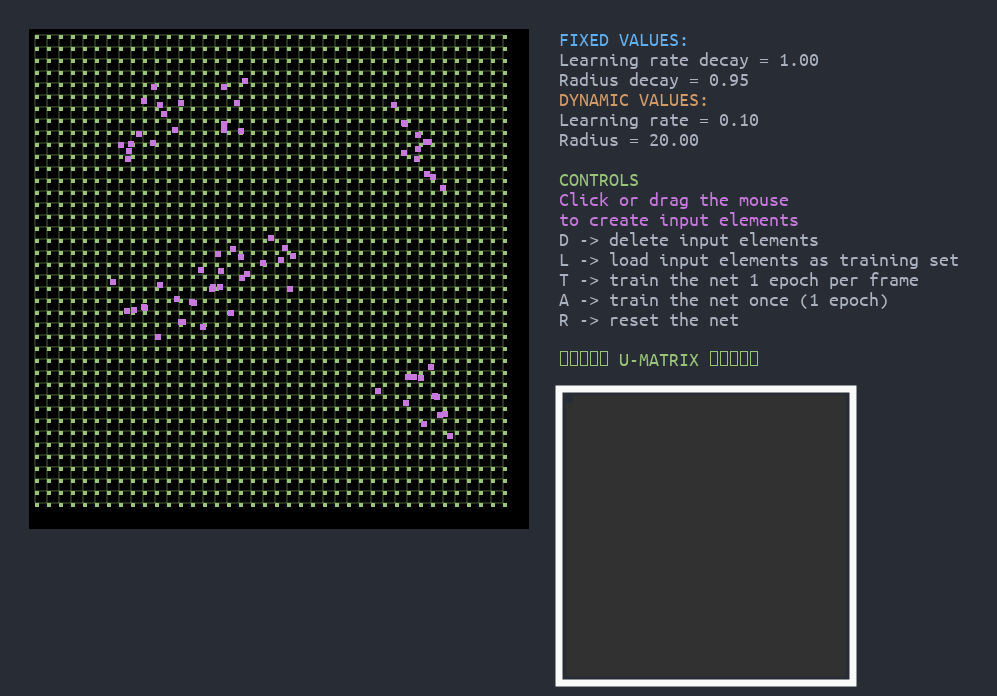
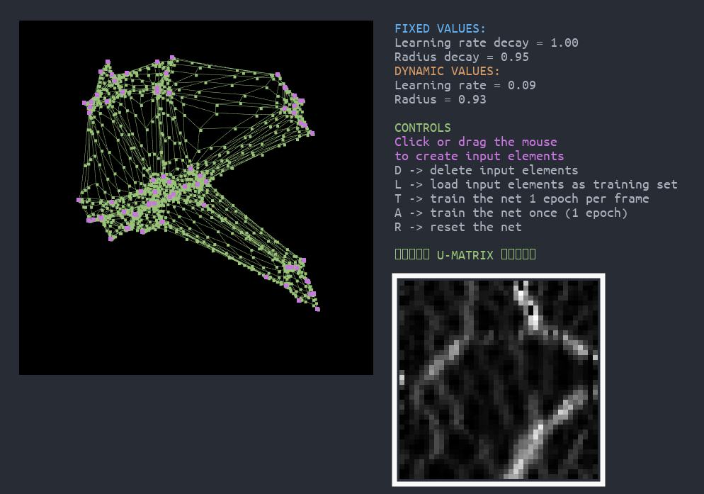

# Kohonen-Network

The projects aims to implement an interactive **Kohoen Network**, a type of **SOM** (Self Organizing Map). Through the GUI the user can insert data, and visualize the network as it learns.  
Kohoen Networks are usually used to perform dimension reduction and normalization on data. In this project, the network maps a 2D input on a grid topology of nodes (therefore, it performs no dimension reduction, just data normalization).

User draws data distribution (purple dots):  


After training:  



## Implementation details

+ Everything has been implemented from scratch by me, with the only exception of graphics libraries (Allegro).
+ Everything has been implemented in C.

## Files and Folders

**bin** -> contains the executable binaries after building  
**build** -> contains the .o object files generated during the compilation  
**conf** -> contains the configuration .h files  
**font** -> contains few fonts used by the application  
**img** -> contains the images used here  
**makefile** -> just a makefile  
**README** -> this file  
**src** -> contains the source code files  

## Installation

First of all, download this repository with:
```
git clone https://www.github.com/FeLusiani/Kohonen-Network.git
```

Then, you need to install Allegro5. The following steps apply to Debian/Ubuntu and are based on the official [wiki](https://wiki.allegro.cc/index.php?title=Install_Allegro5_From_Git/Linux/Debian). Installation on other distros is similar, yet some dependencies may differ. For instance, Centos/RHEL users shall refer to the relative [documentation](https://wiki.allegro.cc/index.php?title=Install_Allegro5_From_Git/Linux/Centos).
Honestly, I'm not sure which deps are strictly necessary and which are not, but unless you have limited storage capacity, I advise to download them all.

First, setup your repo list
```
cd /etc/apt/
sudo gedit sources.list
```
and add `contrib` and `free` at the end of those lines starting with deb or deb-src. Then update:

```sudo apt-get update```

Now install required dependencies:
```
sudo apt-get install build-essential git cmake cmake-curses-gui xorg-dev libgl1-mesa-dev libglu1-mesa-dev
```
and "optional" ones:
```
sudo apt-get install -y cmake g++ freeglut3-dev libxcursor-dev libpng-dev libjpeg-dev libfreetype6-dev libgtk2.0-dev libasound2-dev libpulse-dev libopenal-dev libflac-dev libdumb1-dev libvorbis-dev libphysfs-dev
```

From the Autoparking directory, clone the Allegro5 git repository:
```
git clone https://github.com/liballeg/allegro5.git
```
and switch to version 5.2.4:
```
git checkout 5.2.4
```
Setup the compilation:
```
mkdir build
cd build
ccmake -DCMAKE_INSTALL_PREFIX=/usr ..
```
Inside the cmake environment, press 'C' (configure) and 'E' if it complains about few missing libraries (don't worry, it still works). Then press 'G' (generate).

Here comes the fun, compilation:
```
make
```
You can optionally add the -j option to parallelize (speed up) the compilation on multiple cores.  
Finally, install:
```
make install
```

If all the previous steps went fine, Allegro5 is properly installed and setup.  
All you need now is to compile the Autoparking application, which is very easy. Switch back to the Kohonen-Network directory, and run:
```
make run
```

## Disclaimer

This work has been carried out as final project for the 'Neural Networks' exam at SSSUP. Anyway, anyone is encouraged to fork, modify or extend it for non-commercial purposes, as long as the original author (that's me) is explicitly credited. Feel free to contact me for any doubt!
